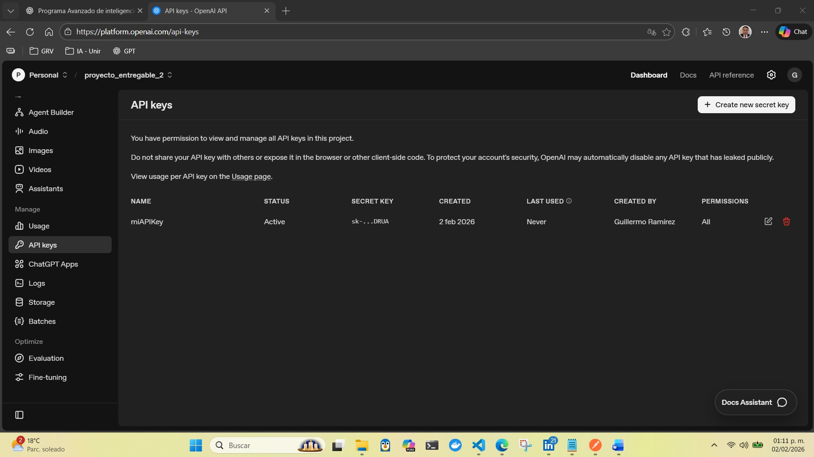
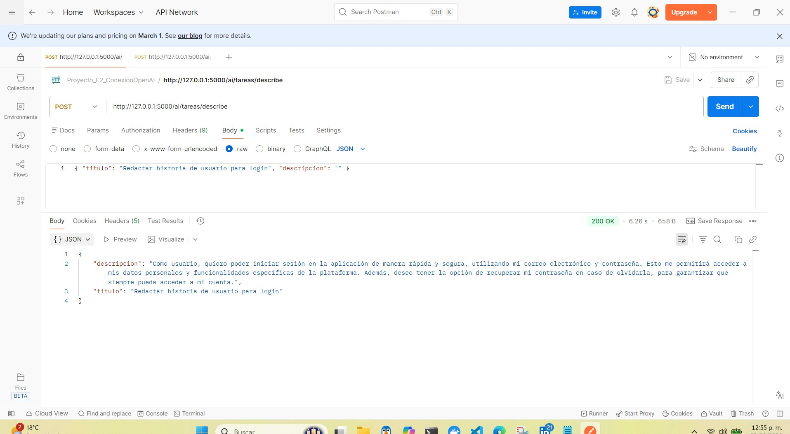
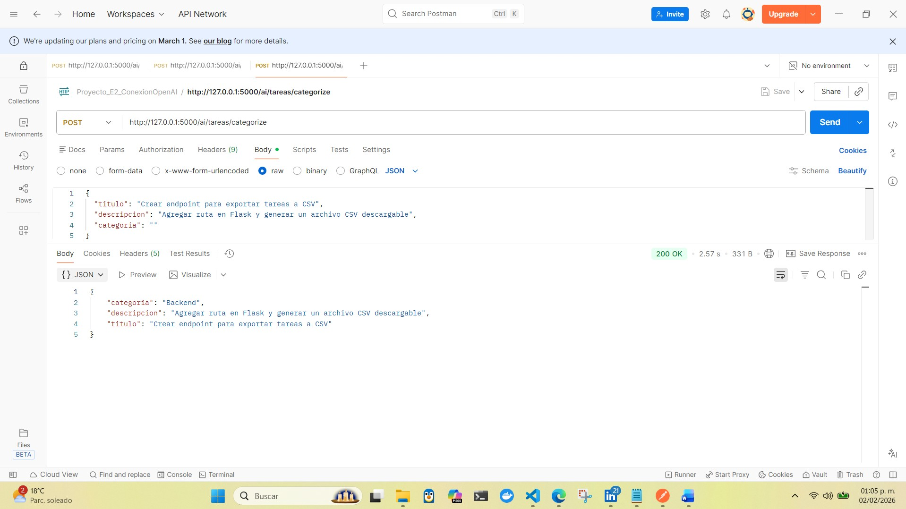
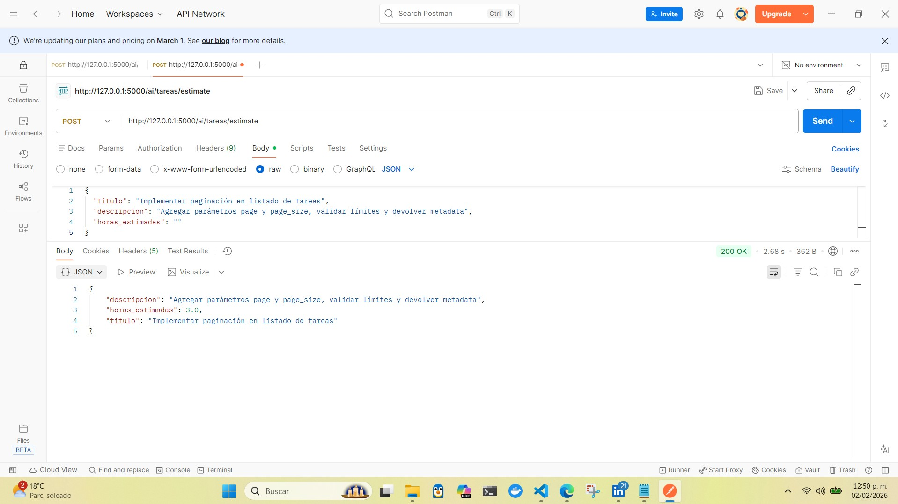
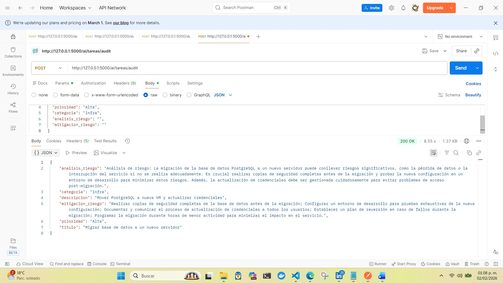

# API REST de Gestión de Tareas + Extensión IA (OpenAI)

Proyecto en **Python 3.12** y **Flask** que implementa un CRUD de tareas (Entregable 1) y lo extiende con endpoints de IA (Entregable 2) siguiendo la guía de:

- [agents_core.md](agents_core.md) — base del proyecto (CRUD + JSON).
- [agents_ai.md](agents_ai.md) — **extensión** del core con IA (sin romper el CRUD).

## Alcance y reglas del Entregable 2 (IA)

Esta extensión agrega endpoints bajo `/ai/*` con estas reglas:

- No rompe ni modifica el comportamiento del CRUD existente.
- La IA **solo completa campos**; por defecto **NO persiste** en `datos/tareas.json`.
- Credenciales **solo por variables de entorno** (no se versionan secretos).
- Todo el código en español, `snake_case`, sin abreviaturas.

## Funcionalidades implementadas

### Entregable 1 (core)

- CRUD REST de tareas persistidas en [datos/tareas.json](datos/tareas.json).
- Modelo `Tarea` con serialización/deserialización.

### Entregable 2 (extensión IA)

- Extensión del modelo `Tarea` con nuevos campos opcionales.
- Servicio IA aislado en [servicios/servicio_ia.py](servicios/servicio_ia.py).
- Blueprint IA con endpoints en [rutas/rutas_ai.py](rutas/rutas_ai.py).
- Integración con **OpenAI** como proveedor vía SDK oficial.

## Arquitectura

Arquitectura simple en capas (sin patrones avanzados), alineada con las guías del core y su extensión IA:

- **Aplicación**: [app.py](app.py)
  - Crea la instancia Flask.
  - Registra Blueprints:
    - CRUD: [rutas/rutas_tareas.py](rutas/rutas_tareas.py)
    - IA: [rutas/rutas_ai.py](rutas/rutas_ai.py)

- **Rutas (API)**:
  - [rutas/rutas_tareas.py](rutas/rutas_tareas.py): endpoints CRUD que persisten en JSON.
  - [rutas/rutas_ai.py](rutas/rutas_ai.py): endpoints `/ai/*` que enriquecen una tarea (no persisten por defecto).

- **Servicios**:
  - [servicios/gestor_tareas.py](servicios/gestor_tareas.py): lectura/escritura de [datos/tareas.json](datos/tareas.json).
  - [servicios/servicio_ia.py](servicios/servicio_ia.py): prompts + llamadas a OpenAI + normalización de salidas.

- **Modelos**:
  - [modelos/tarea.py](modelos/tarea.py): entidad `Tarea` y conversiones `a_diccionario()` / `desde_diccionario()`.

Flujo típico:

1) Cliente HTTP → endpoint (ruta)
2) Ruta valida JSON mínimo
3) Ruta delega a servicio (persistencia o IA)
4) Ruta devuelve JSON

## Modelo de datos: `Tarea`

Campos existentes (core):

- `identificador`
- `titulo`
- `descripcion`
- `prioridad`
- `horas_estimadas`
- `estado`
- `asignado_a`

Campos nuevos (IA, Entregable 2):

- `categoria` (opcional)
- `analisis_riesgo` (opcional)
- `mitigacion_riesgo` (opcional)

Compatibilidad:
- Tareas antiguas pueden no incluir estos campos.
- La carga desde JSON aplica valores por defecto cuando falten.

## Endpoints expuestos

Base (CRUD):

- `GET /` (verificación rápida)
- `GET /tareas`
- `GET /tareas/<identificador>`
- `POST /tareas`
- `PUT /tareas/<identificador>`
- `DELETE /tareas/<identificador>`

IA (Entregable 2):

- `POST /ai/tareas/describe`
  - Completa `descripcion` si viene vacía.
- `POST /ai/tareas/categorize`
  - Completa `categoria` si viene vacía.
  - Categorías controladas: `Frontend`, `Backend`, `Testing`, `Infra`, `DevOps`, `Documentación`, `Seguridad`, `Datos`, `Otro`.
- `POST /ai/tareas/estimate`
  - Completa `horas_estimadas` si viene vacío/ausente.
  - Parseo obligatorio del primer número a `float`.
- `POST /ai/tareas/audit`
  - Completa `analisis_riesgo` y `mitigacion_riesgo` si vienen vacíos.
  - Flujo de **dos llamadas**: (1) análisis → (2) mitigación usando el análisis.

## Detalle de endpoints

Convenciones generales:

- Requests y responses son JSON.
- Si el body no es JSON (o no es un objeto), se responde `400`.
- En endpoints IA, si el campo objetivo ya viene con contenido, se devuelve `200` sin cambios.

### `GET /`

Propósito: verificar que la aplicación está levantada.

- Respuesta `200`:
  - `{"estado":"aplicacion_en_ejecucion"}`

### `GET /tareas`

Propósito: listar todas las tareas persistidas.

- Respuesta `200`: lista de tareas.

### `GET /tareas/<identificador>`

Propósito: obtener una tarea por identificador.

- Respuesta `200`: tarea encontrada.
- Respuesta `404`: si no existe.

### `POST /tareas`

Propósito: crear una tarea y guardarla en JSON.

- Body: JSON con campos del modelo (según validaciones del CRUD).
- Respuesta `201`: tarea creada.
- Respuesta `400`: JSON inválido o campos requeridos ausentes.

### `PUT /tareas/<identificador>`

Propósito: actualizar una tarea existente (parcialmente) y persistir.

- Respuesta `200`: tarea actualizada.
- Respuesta `404`: si no existe.
- Respuesta `400`: JSON inválido.

### `DELETE /tareas/<identificador>`

Propósito: eliminar una tarea por identificador.

- Respuesta `200`: tarea eliminada.
- Respuesta `404`: si no existe.

### `POST /ai/tareas/describe`

Propósito: completar `descripcion` cuando venga vacía.

- Requiere: `titulo`.
- No persiste en `datos/tareas.json`.
- Respuesta `200`: devuelve la misma tarea con `descripcion` completada.
- Respuesta `400`: JSON inválido o falta `titulo`.
- Respuesta `500`: fallo controlado al consultar OpenAI.

Ejemplo de body:

```json
{
  "titulo": "Implementar endpoint de listado",
  "descripcion": "",
  "prioridad": "Media",
  "estado": "pendiente",
  "asignado_a": "Guillermo"
}
```

### `POST /ai/tareas/categorize`

Propósito: completar `categoria` cuando venga vacía.

- Requiere: `titulo` (y opcionalmente `descripcion`).
- No persiste en `datos/tareas.json`.
- Respuesta `200`: devuelve la tarea con `categoria` completada.
- Respuesta `400`: JSON inválido o falta `titulo`.
- Respuesta `500`: fallo controlado al consultar OpenAI.

Nota: la categoría se normaliza para caer siempre en la lista controlada.

Ejemplo de body:

```json
{
  "titulo": "Crear pruebas unitarias del gestor",
  "descripcion": "Agregar pruebas para carga/guardado de JSON",
  "categoria": ""
}
```

### `POST /ai/tareas/estimate`

Propósito: completar `horas_estimadas` cuando venga ausente/vacía.

- Requiere: `titulo` (idealmente también `descripcion`).
- No persiste en `datos/tareas.json`.
- Respuesta `200`: devuelve la tarea con `horas_estimadas` como número (`float`).
- Respuesta `400`: JSON inválido, falta `titulo`, o la respuesta de IA no se pudo parsear a número.
- Respuesta `500`: fallo controlado al consultar OpenAI.

Ejemplo de body:

```json
{
  "titulo": "Implementar endpoint POST /tareas",
  "descripcion": "Crear endpoint, validar campos y guardar en JSON",
  "categoria": "Backend",
  "horas_estimadas": null
}
```

### `POST /ai/tareas/audit`

Propósito: completar `analisis_riesgo` y `mitigacion_riesgo` cuando vengan vacíos.

- Requiere: `titulo`.
- No persiste en `datos/tareas.json`.
- Flujo:
  1) Genera `analisis_riesgo` (si falta)
  2) Genera `mitigacion_riesgo` usando la tarea + el análisis (si falta)
- Respuesta `200`: devuelve la tarea con campos completados.
- Respuesta `400`: JSON inválido o falta `titulo`.
- Respuesta `500`: fallo controlado al consultar OpenAI.

Ejemplo de body:

```json
{
  "titulo": "Migrar base de datos a un nuevo servidor",
  "descripcion": "Mover PostgreSQL a nueva VM y actualizar credenciales",
  "prioridad": "Alta",
  "categoria": "Infra",
  "analisis_riesgo": "",
  "mitigacion_riesgo": ""
}
```

## Proveedor IA: OpenAI (SDK oficial)

La integración está encapsulada en [servicios/servicio_ia.py](servicios/servicio_ia.py) y utiliza el **SDK oficial** de OpenAI.

**Énfasis en endpoints/métodos de OpenAI utilizados:**

- **Responses API** (preferida): `client.responses.create(...)`
- **Fallback** (compatibilidad): `client.chat.completions.create(...)`

El servicio intenta usar Responses API cuando está disponible en el SDK instalado; si no, usa Chat Completions.

## Configuración (variables de entorno)

Variables requeridas:

- `OPENAI_API_KEY` (obligatoria)
- `OPENAI_MODEL` (opcional, por defecto: `gpt-4o-mini`)

Este repo incluye:

- [.env.example](.env.example) (plantilla sin secretos)
- `.env` (archivo local **NO versionado**, debe existir en tu máquina)

## Instalación y ejecución (Windows / PowerShell)

### 1) Crear y activar entorno virtual

Desde la raíz del proyecto:

```powershell
python -m venv .venv
```

Para permitir ejecutar scripts en la sesión actual (bypass):

```powershell
Set-ExecutionPolicy -Scope Process -ExecutionPolicy Bypass
```

Activar el entorno virtual:

```powershell
. .\.venv\Scripts\Activate.ps1
```

### 2) Instalar dependencias

```powershell
pip install -r requirements.txt
```

### 3) Crear `.env` (sin versionar)

Copia la plantilla y pega tu clave:

```powershell
Copy-Item .env.example .env
```

Edita `.env` y configura:

- `OPENAI_API_KEY=...`
- `OPENAI_MODEL=gpt-4o-mini` (opcional)

### 4) Ejecutar cargando variables desde `.env`

Opción recomendada (script que carga `.env` en variables **del proceso** y levanta Flask):

```powershell
.\scripts\ejecutar_con_env.ps1
```

Si PowerShell bloquea el script, ejecútalo con bypass:

```powershell
powershell -ExecutionPolicy Bypass -File .\scripts\ejecutar_con_env.ps1
```

Opción alternativa (sin script):

```powershell
$env:OPENAI_API_KEY = "PEGA_TU_CLAVE_AQUI"
$env:OPENAI_MODEL = "gpt-4o-mini"
python app.py
```

Servidor local:

- `http://127.0.0.1:5000`

## Modificaciones realizdas 14 de febrero 2026

Esta sección documenta los cambios realizados para mejorar la **testabilidad**, la **organización** y la **trazabilidad** del proyecto, manteniendo el comportamiento de la API.

### 1) App Factory para facilitar pruebas automatizadas

Se agregó una función factory `crear_aplicacion()` para construir la app Flask en un entorno de tests sin levantar un servidor real.

Fragmento (app.py):

```python
def crear_aplicacion() -> Flask:
  aplicacion = Flask(__name__)
  aplicacion.register_blueprint(plano_rutas_tareas)
  aplicacion.register_blueprint(plano_rutas_ai)

  @aplicacion.get("/")
  def inicio():
    return jsonify({"estado": "aplicacion_en_ejecucion"}), 200

  return aplicacion


aplicacion = crear_aplicacion()
```

Explicación:
- `pytest` puede importar `crear_aplicacion()` y usar `aplicacion.test_client()`.
- Se mantiene compatibilidad con `python app.py` mediante la instancia global `aplicacion`.

### 2) Persistencia configurable para ejecutar tests sin tocar datos reales

Se agregó una variable de entorno opcional `TAREAS_JSON_PATH` para redirigir la persistencia a un archivo JSON alternativo durante tests.

Fragmento (servicios/gestor_tareas.py):

```python
ruta_override = os.getenv("TAREAS_JSON_PATH")
if isinstance(ruta_override, str) and ruta_override.strip() != "":
  return Path(ruta_override).expanduser().resolve()
```

Explicación:
- En ejecución normal, la app sigue usando `datos/tareas.json`.
- En tests, se configura `TAREAS_JSON_PATH` a un archivo temporal (por ejemplo con `tmp_path`).

### 3) Suite de tests con pytest (sin llamadas reales a OpenAI)

Se creó una carpeta `tests/` con:
- tests de `GET /` (healthcheck),
- tests del CRUD completo (`/tareas`),
- tests de endpoints IA (`/ai/*`) usando mocks, evitando depender de red o credenciales.

Fragmento (tests/conftest.py):

```python
@pytest.fixture()
def ruta_tareas_temporal(tmp_path: Path, monkeypatch: pytest.MonkeyPatch) -> Path:
  ruta = tmp_path / "tareas.json"
  ruta.write_text("[]", encoding="utf-8")
  monkeypatch.setenv("TAREAS_JSON_PATH", str(ruta))
  return ruta
```

Fragmento (tests/test_ai_endpoints.py):

```python
import rutas.rutas_ai as rutas_ai
monkeypatch.setattr(rutas_ai, "obtener_categoria_simulada", lambda titulo, descripcion=None: "Backend")
```

Explicación:
- Los endpoints IA se prueban validando el contrato del JSON, pero reemplazando la llamada real por funciones mock.

### 4) Mensajes de error IA más informativos (sin exponer secretos)

Se mejoró el `RuntimeError` envolvente para incluir una pista según el `status_code` (por ejemplo 401 para API key inválida).

Fragmento (servicios/servicio_ia.py):

```python
status_code = getattr(excepcion, "status_code", None)
if status_code == 401:
  mensaje_extra = " (401: autenticación fallida; revisa OPENAI_API_KEY)"
raise RuntimeError(f"Error al consultar el proveedor de IA{mensaje_extra}") from excepcion
```

Explicación:
- Se mantiene el mensaje general, pero se agrega contexto útil para diagnóstico.
- No se imprime ni registra la API key.

### 5) Cómo ejecutar los tests

1) Instalar dependencias de desarrollo:

```powershell
pip install -r requirements-dev.txt
```

2) Ejecutar la suite:

```powershell
pytest -q
```

## Pruebas rápidas (PowerShell)

### Categorize

```powershell
curl -Method POST http://127.0.0.1:5000/ai/tareas/categorize `
  -ContentType "application/json" `
  -Body '{"titulo":"Crear endpoint para exportar a CSV","descripcion":"Agregar ruta en Flask y generar archivo CSV","categoria":""}'
```

### Audit

```powershell
curl -Method POST http://127.0.0.1:5000/ai/tareas/audit `
  -ContentType "application/json" `
  -Body '{"titulo":"Migrar base de datos a nuevo servidor","descripcion":"Mover PostgreSQL a nueva VM y actualizar credenciales","prioridad":"Alta","categoria":"Infra","analisis_riesgo":"","mitigacion_riesgo":""}'
```

## Tests (pytest)

Instalar dependencias de desarrollo:

```powershell
pip install -r requirements-dev.txt
```

Ejecutar tests:

```powershell
pytest -q
```

## Evidencias (OpenAI)

Capturas ubicadas en [documentos_OPENAI/](documentos_OPENAI/):

### Configuración de API Key



### Endpoint `/ai/tareas/describe`



### Endpoint `/ai/tareas/categorize`



### Endpoint `/ai/tareas/estimate`



### Endpoint `/ai/tareas/audit`



---

Notas:
- La carpeta [documentos/imagenes_postman/](documentos/imagenes_postman/) contiene evidencias del CRUD (Entregable 1).
- Por seguridad, no subas `.env` al repositorio.
