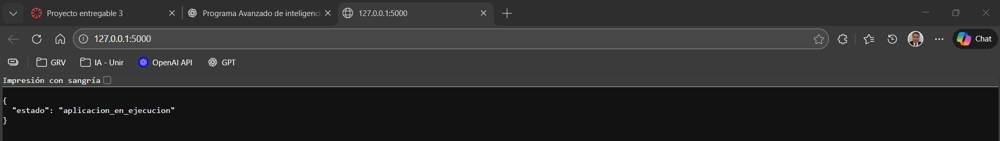
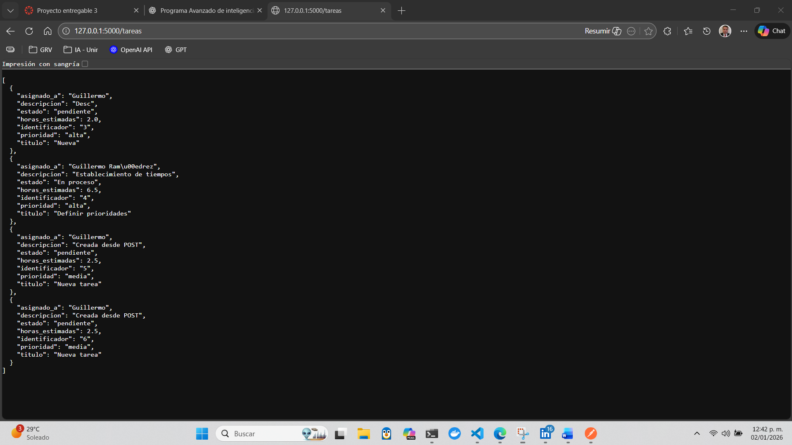
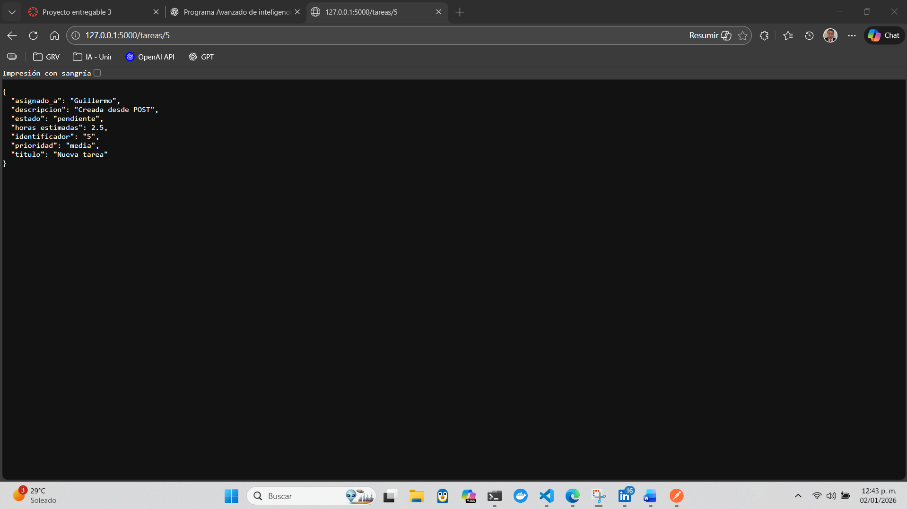
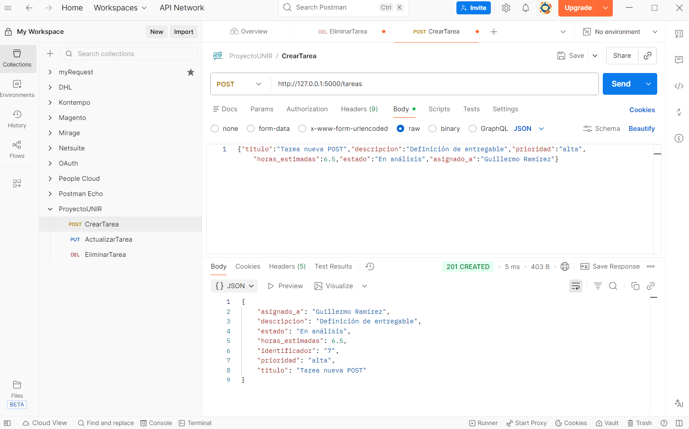
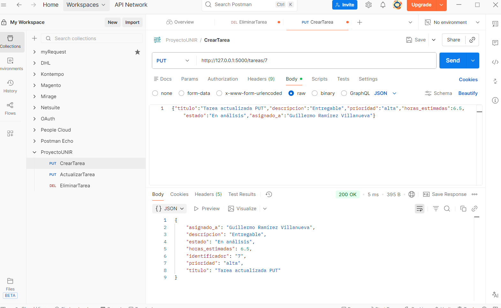
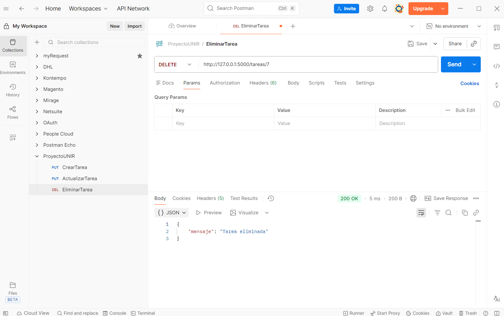

# API REST de gestión de tareas (Flask)

Proyecto en **Python 3.12** y **Flask** para gestionar tareas asignadas a usuarios, usando un archivo **JSON** como almacenamiento.

Este repositorio se desarrolla de forma incremental siguiendo las reglas definidas en `agents.md`.

---

## Objetivo

Construir una API REST en Flask para la gestión de tareas:
- Crear tareas
- Consultar tareas
- Actualizar tareas
- Eliminar tareas

Persistencia:
- Las tareas se guardan en `datos/tareas.json`

---

## Reglas de nombrado (obligatorias)

Según `agents.md`, todo el código del proyecto debe:
- Estar en **español**
- Usar **snake_case**
- **No** usar abreviaturas
- Preferir claridad sobre brevedad

---

## Estructura del proyecto

Estructura esperada (según `agents.md`):

```
proyecto/
├── app.py
├── rutas/
│   └── rutas_tareas.py
├── modelos/
│   └── tarea.py
├── servicios/
│   └── gestor_tareas.py
├── datos/
│   └── tareas.json
├── documentos/
│   └── imagenes_postman/
├── venv/
└── requirements.txt
```

Qué va en cada carpeta:
- `modelos/`: clases del dominio (por ejemplo, `Tarea`).
- `servicios/`: persistencia y lógica de acceso a datos (por ejemplo, `GestorTareas`).
- `rutas/`: endpoints Flask (Blueprints).
- `datos/`: almacenamiento local en JSON.
- `documentos/`: evidencias (capturas de Postman).

---

## Arquitectura

Arquitectura simple en capas (sin patrones avanzados):

- **Aplicación**: `app.py`
  - Crea la instancia de Flask.
  - Registra el Blueprint de tareas.

- **Rutas (API)**: `rutas/rutas_tareas.py`
  - Define endpoints HTTP (GET/POST/PUT/DELETE).
  - No contiene lógica de persistencia; delega a `GestorTareas`.
  - Convierte `Tarea` ↔ diccionario para responder JSON.

- **Modelo**: `modelos/tarea.py`
  - Representa la entidad `Tarea`.
  - Provee `a_diccionario()` y `desde_diccionario()`.

- **Servicio de persistencia**: `servicios/gestor_tareas.py`
  - Lee y escribe en `datos/tareas.json`.
  - Devuelve/recibe listas de objetos `Tarea`.
  - Maneja archivo inexistente y JSON vacío/inválido devolviendo lista vacía.

Flujo típico de una petición:

1) Cliente HTTP → endpoint en `rutas/rutas_tareas.py`
2) Ruta llama a `GestorTareas.cargar_tareas()` o `GestorTareas.guardar_tareas(...)`
3) `GestorTareas` lee/escribe `datos/tareas.json` y trabaja con objetos `Tarea`
4) Ruta convierte a diccionarios con `a_diccionario()` y responde JSON

---

## Instalación

> Recomendado: usar entorno virtual `venv`.

1) Crear entorno virtual (si no existe):

```powershell
python -m venv venv
```

2) Activar entorno virtual:

```powershell
Set-ExecutionPolicy -Scope Process -ExecutionPolicy Bypass
.\venv\Scripts\Activate.ps1
```

3) Instalar dependencias:

```powershell
pip install -r requirements.txt
```

---

## Ejecución

Levantar la API:

```powershell
python app.py
```

Rutas disponibles:
- `GET /` (verificación simple)
- `GET /tareas`
- `GET /tareas/<identificador>`
- `POST /tareas`
- `PUT /tareas/<identificador>`
- `DELETE /tareas/<identificador>`

---

## Endpoints

### GET /tareas
Devuelve la lista completa de tareas almacenadas.

### GET /tareas/<identificador>
Devuelve una tarea por identificador (si existe).

### POST /tareas
Crea una tarea.

Body JSON requerido:

```json
{
  "titulo": "Nueva",
  "descripcion": "Desc",
  "prioridad": "alta",
  "horas_estimadas": 2,
  "estado": "pendiente",
  "asignado_a": "Guillermo"
}
```

Respuesta:
- `201` con la tarea creada.

### PUT /tareas/<identificador>
Actualiza parcialmente una tarea.

Ejemplo de body:

```json
{
  "titulo": "Título actualizado"
}
```

Respuesta:
- `200` con la tarea actualizada.
- `404` si no existe.

### DELETE /tareas/<identificador>
Elimina una tarea.

Respuesta:
- `200` si se eliminó.
- `404` si no existe.

---

## Pruebas rápidas con curl (PowerShell)

> En PowerShell usa `curl.exe` (para evitar el alias de `Invoke-WebRequest`).

GET lista:

```powershell
curl.exe http://127.0.0.1:5000/tareas
```

POST crear:

```powershell
curl.exe -X POST http://127.0.0.1:5000/tareas -H "Content-Type: application/json" -d "{\"titulo\":\"Nueva\",\"descripcion\":\"Desc\",\"prioridad\":\"alta\",\"horas_estimadas\":2,\"estado\":\"pendiente\",\"asignado_a\":\"Guillermo\"}"
```

PUT actualizar:

```powershell
curl.exe -X PUT http://127.0.0.1:5000/tareas/1 -H "Content-Type: application/json" -d "{\"titulo\":\"Titulo actualizado\"}"
```

DELETE eliminar:

```powershell
curl.exe -X DELETE http://127.0.0.1:5000/tareas/1
```

---

## Evidencias (Postman)

Capturas ubicadas en `documentos/imagenes_postman/`:

### Verificación de la aplicación (GET /)


### GET /tareas


### GET /tareas/<identificador>


### POST /tareas


### PUT /tareas/<identificador>


### DELETE /tareas/<identificador>

